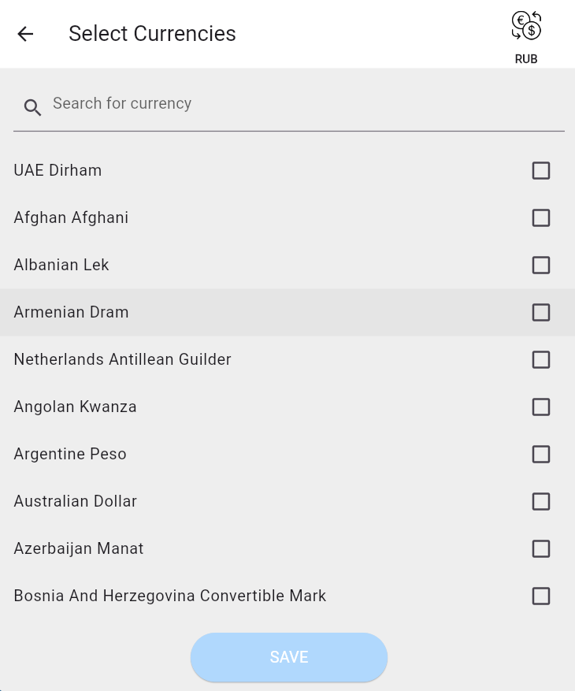
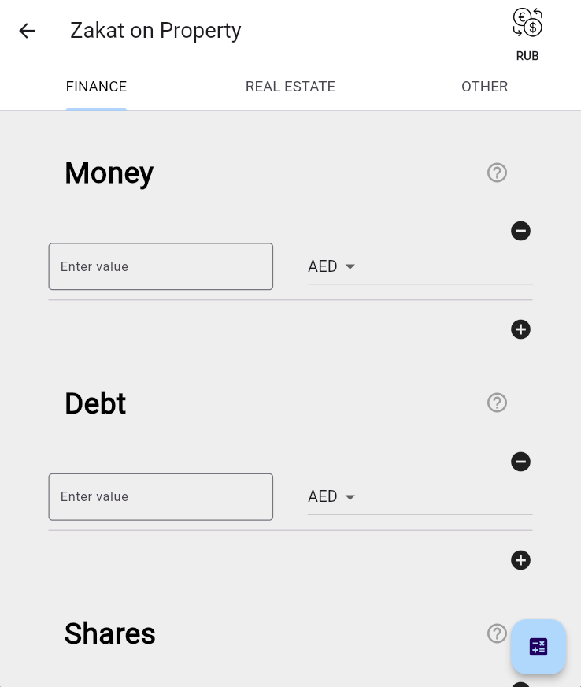
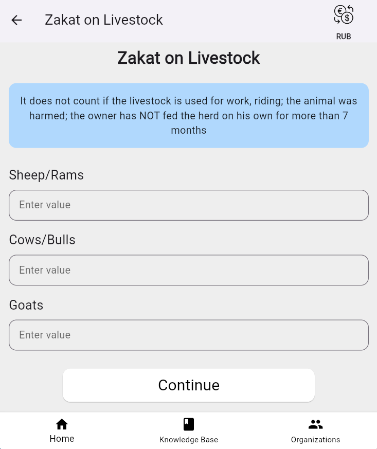
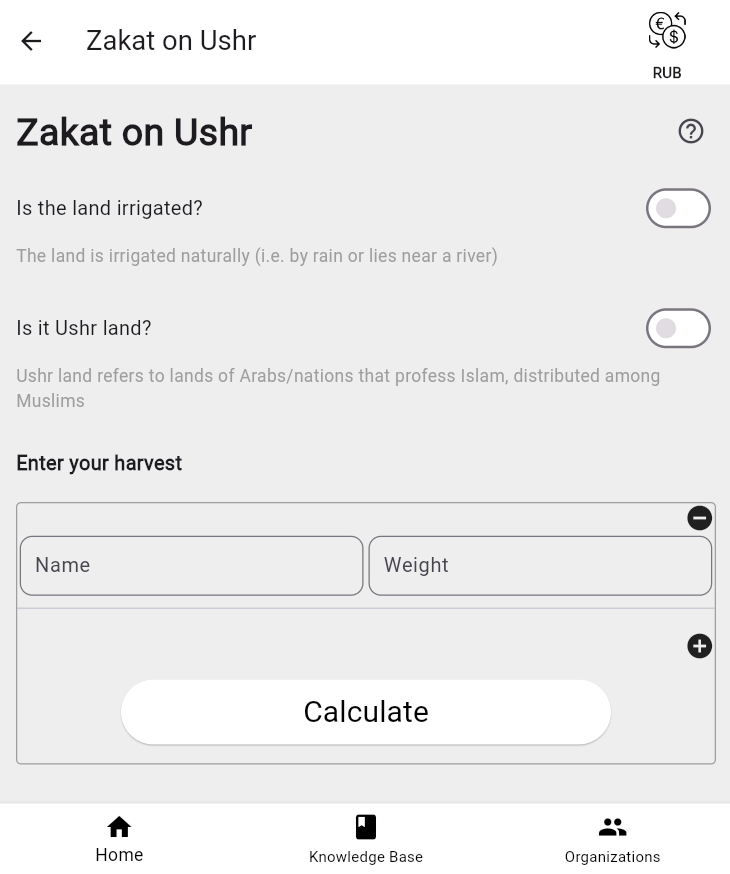
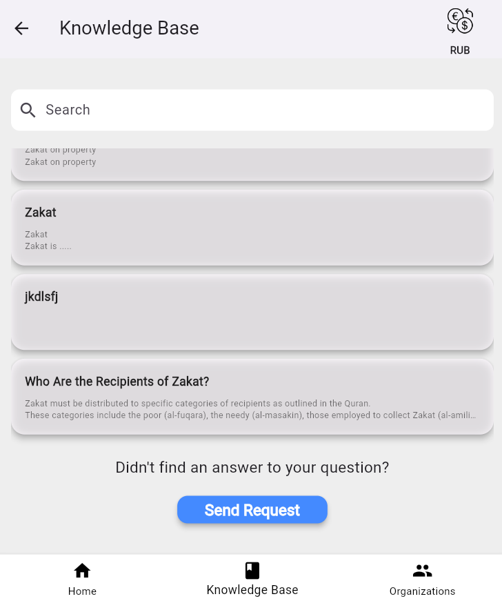
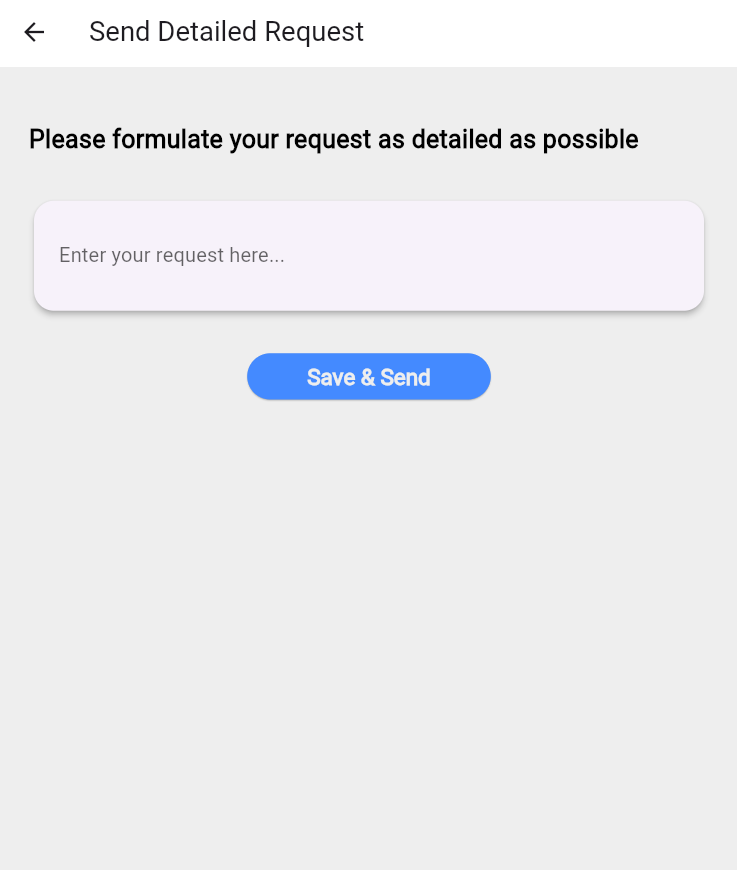
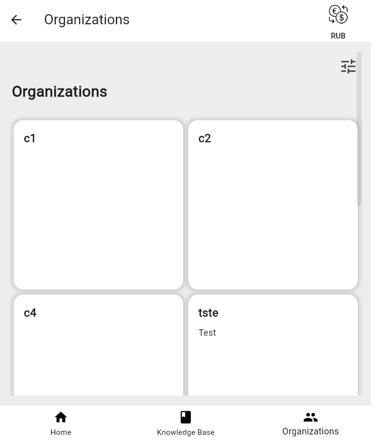
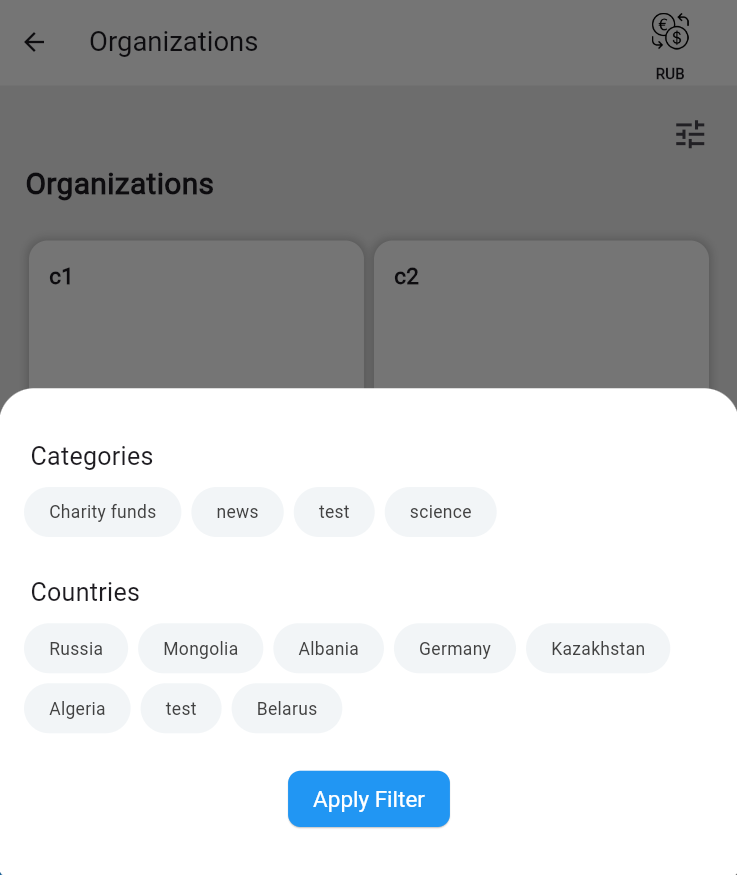
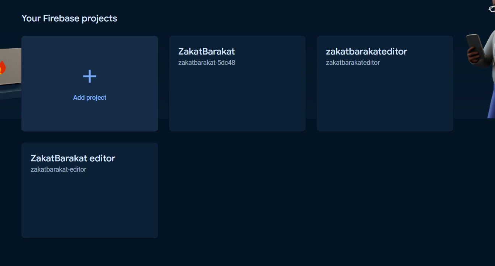

## README ZakatBarakat app

---

# ZakatBarakat app  

Zakat is a type of almsgiving in Islam, an every wealthy enough Muslim that passed the Nisab threshold must pay Zakat. However, calculating Zakat involves several difficulties that makes its payment not likely to be performed. Existing Zakat Calculators oversimplify the process. Moreover, they lack knowledge about Zakat and Q&A service. Therefore, our project aims at creating an appropriate Zakat calculator with embedded knowledge base

This product allows you to calculate 3 types of zakat, browse the Knowledge Base, search for information on it, and in case you didn't find what you were looking for, make a requisition for the editor. Also you can view news, organizations of different categories, virified charity funds. Also everything in the calculator is calculated at the current rate.

---

## Table of Contents

- [Features](#features)
- [Demo](#demo)
- [Link to the product](#link-to-the-product)
- [User guide](#user-guide)
- [Prerequisites](#prerequisites)
- [Setup](#setup)
- [Frameworks](#frameworks)
- [For customer](#for-customer)
- [License](#license)
---

## Features

- Clear design
- Ask questions based on Knowledge base, with using AI
- Firebase provides analytics on app
- Exhaustive typing in the calculator, based on the Hanafi school
- Calculating Zakat on Property
- Calculating Zakat on Livestock
- Calculating Zakat Ushr
- Accessing the knowledge base 
- Accessing the articles 
- Search for articles and questions
- Making a request for extra information
- Get the list of verified funds
- Get the list of organizations
---
## Demo

### HomePage

### Favorite currency selection in Zakat on property

### Zakat on property page

### Zakat on livestock page

### Zakat on Ushr

### Knowledge base

### Request sending

### Main currency selection

### Organizations

### Organizations filter


---

## Link to the product
- [On Firebase](https://zakatbarakat-5dc48.web.app/#/home)
- [On gitlab pages](https://zakatcalcteam55-d-fatkullina-74cb57c84a15054e0fcde5bfea4973a996.pages.pg.innopolis.university/)

---

## User guide
### Zakat on property
- first of all you need to select main currency using button on top right corner, based on it you will have zakat overall value
- then on home page you need to tap on **home icon**
- then you are taken to a page where you need to select currencies, which will be used for calculating. **Important: you will receive zakat value in main currency, which you selected at first step**
- then you are taken to a page where you need to set your info
- after clicking on button in bottom right corner you will go to zakat overall page

### Zakat on livestock
- button in the middle of home page with **cow icon**
- just set info about livestock and click on ***Calculate*** button

### Zakat Ushr
- button in the middle of home page with **hand icon**
- specify info about your land and add crops

### Knowledge base
- Find info in articles or search it
- In cases, when you did not find an answer **Send request**

### Organizations
- Filter organizations by categories and countries

### News
- Read news description at home page and bu clicking on them you will be redirected to news site


---
## Prerequisites

- [Flutter SDK](https://flutter.dev/docs/get-started/install) installed on your local machine
- An editor of your choice (e.g., [Visual Studio Code](https://code.visualstudio.com/), [Android Studio](https://developer.android.com/studio))

---

## Setup

1. **Clone the repository**

   ```sh
   git clone https://gitlab.pg.innopolis.university/d.fatkullina/zakatcalcteam55.git
   ```

2. **Install dependencies**

   ```sh
   flutter pub get
   ```

3. **Run the application**

    ```sh
     flutter run
    ```
---


## Frameworks

- Flutter
- Firebase for hosting
---

## For customer

### Deployment instructions (for Customer)

#### Hosting on [Firebase](https://firebase.google.com/), [video](https://www.youtube.com/watch?v=OwO0oPcCeX0&ab_channel=AdityaThakur) with description
1. Register on [Firebase](https://firebase.google.com/)
2. Go to console and **Add** project

3. Specify name
4. tap continue 3 times (agree with all u need)
5. Create project
6. In left bar in build section go to Hosting
7. In Get Started You will find all necessary information, like downloading NodeJS and command prompts
8. After creating project run this commands in command line in project repo:
    ```sh
     npm install -g firebase-tools
     firebase login
    ```
    you will be redirected for auth, then
    ```sh
     firebase init 
    ```
    what you need to select and answer you can see in video. Then
    ```sh
     flutter build web
     firebase deploy 
    ```

### Sources
- [Azan.ru](https://azan.ru/islam/zakat)
- [Q&A azan.ru](https://azan.ru/ramadan#description_soum-zakat)
- [Unma](https://umma.ru/voprosy-i-otvety-po-vyplate-zakyata-praktika-zhizni)
- [Ahmad Abu Yahya's video](https://vk.com/wall-69899854_757)
---

## License
Distributed under the MIT License. See `LICENSE.txt` for more information.

